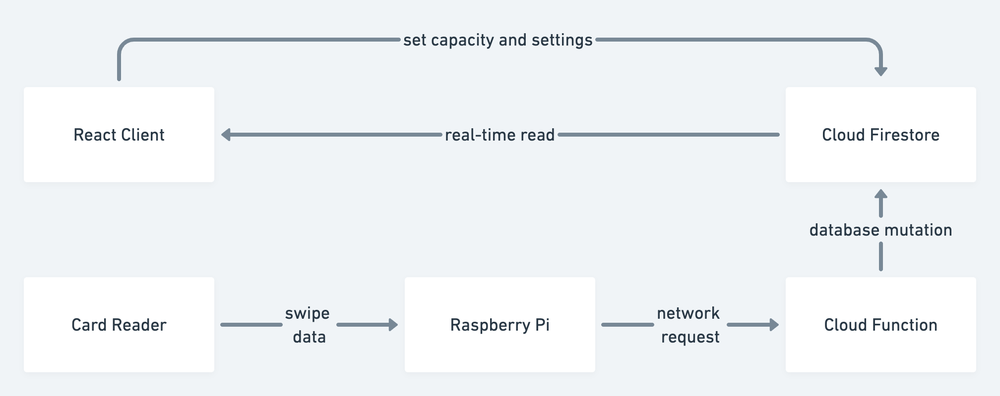

# CEID Signage Frontend

- [CEID Signage Frontend](#ceid-signage-frontend)
  - [Architecture](#architecture)
  - [Card Reader and Raspberry Pi](#card-reader-and-raspberry-pi)
    - [Setup on Raspberry Pi](#setup-on-raspberry-pi)
    - [Running the reader](#running-the-reader)
  - [Cloud Function](#cloud-function)
    - [Development](#development)
    - [Deployment to Firebase Cloud Functions](#deployment-to-firebase-cloud-functions)
  - [Cloud Firestore](#cloud-firestore)
  - [React Client](#react-client)
    - [Development](#development-1)
    - [Deployment to Firebase Hosting](#deployment-to-firebase-hosting)

## Architecture



## Card Reader and Raspberry Pi

This code is located in `card-reader`. It is based on <https://github.com/micolous/pcprox>.

### Setup on Raspberry Pi

```bash
# go to folder
cd card-reader
# create venv
python3 -m venv pyvenv
# install dependencies
pip3 install -r requirements.txt
# copy rules
sudo install -o0 -g0 -m0644 lib/udev/60-rfideas-permissions.rules /etc/udev/rules.d/
sudo udevadm control --reload-rules
```

### Running the reader

```
python3 card-reader.py
```

## Cloud Function

Use this `GET` endpoint: <https://us-central1-ceid-swiper.cloudfunctions.net/swipeCard>

It expects one query parameter:

- `tagId (string)`: a unique identifier for a swipe log.

### Development

```bash
firebase serve
```

### Deployment to Firebase Cloud Functions

```bash
firebase deploy
```

## Cloud Firestore

This can be inspected (along with all other Firebase functionality) in the console: <https://console.firebase.google.com/>

## React Client

### Development

```bash
yarn start
```

### Deployment to Firebase Hosting

```bash
yarn build
firebase deploy
```
